# Awesome

My own curated (meaning subjective) list of awesome things (relating to
computer science). I have (tried to) include examples and screenshots of
everything. [Unlicensed](license.md) for maximum fork enjoyment. 

*Please send in
pull requests if I missed anything obvious!*

This is kind of supposed to be a replacement for my browser bookmarks.
I thought it would be better to put these links out here for everyone,
than to have them rot in my previous convoluted folder hierachies.

## Contents

- [Entertainment](#entertainment) *that isn't pointless*.
    - [Journals](#journals)
    - [News](#news)
    - [Blogs](#blogs)
    - [Videos](#videos)
- [Resources](#resources) *to help you learn*.
    - [Web](#web)
    - [Books](#books)
    - [Papers](#papers)
- [Challenges](#challenges) *for programmers*.
    - [Math](#math)
    - [Crypto](#crypto)
    - [Coding](#coding)
    - [Commercial](#commercial)
    - [Resources](#resources-1)
- [Design](#design) *resources that might help you*.
    - [Photography](#photography)
    - [Fonts](#fonts)
    - [Other](#other)
- [Tools](#tools) *that I find essential*.
    - [Basics](#basics)
    - [GUI](#gui)
- [Languages](#languages)
    - [Ruby](#ruby)
    - [Crystal](#crystal)
    - [Rust](#rust)
    - [C](#c-language)
    - [Python](#python)
    - [Scheme](#scheme)
    - [OCaml](#ocaml)
    - [Node.js](#node-js)
    - [Haskell](#haskell)
    - [RISC-V Asm](#risc-v-asm)
    - [C++](#c-language-1)
    - [Swift](#swift)
    - [Nim](#nim)
    - [Lua](#lua)
    - [D](#d)
- [Further](#further) *things I don't know how to categorize*.

# Entertainment

## Journals

Semi-regular publications. As the publication frequency is much lower than
news websites, these can go into much more detail and are thus probably the
best way to s

#### PoC||GTFO: [`alchemistowl.org/pocorgtfo`](https://www.alchemistowl.org/pocorgtfo/)

> The international journal of *Proof of Concept or Get The Fuck Out*.

Contains a healthy mixture of humorous and very in-depth technical articles of
how to hack, with a focus on retro hardware and mind-boggling file format
hackery.

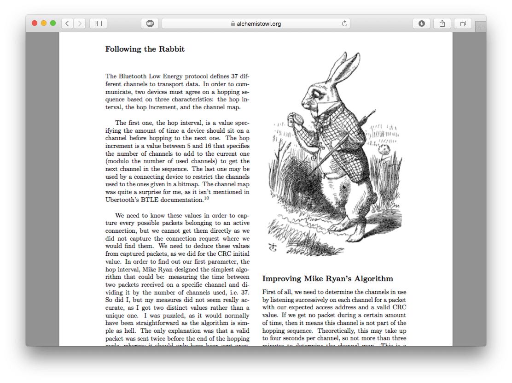

## News

These are news sites worth reading and hopefully re-reading, about technology
and related topics.

#### Lobsters: [`lobste.rs`](https://lobste.rs/), ★★★★★

> Technology-focused community centered around link aggregation and discussion.

All links are user-submitted. Small friendly community. Invite-only and ad free.

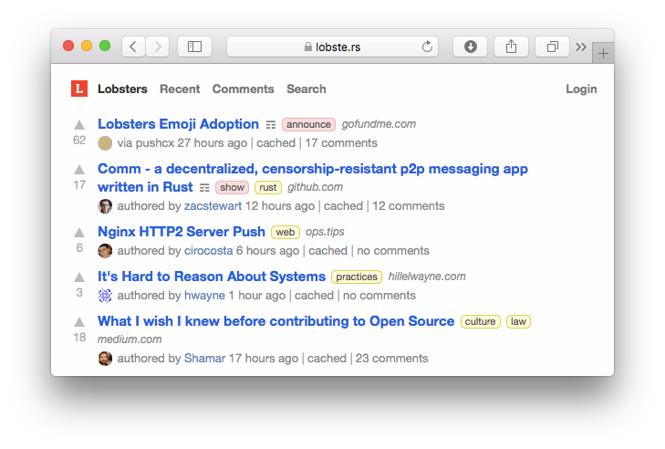

#### Hacker News: [`news.ycombinator.com`](https://news.ycombinator.com/), ★★★★☆

> Social news website focusing on computer science and entrepreneurship.

Run by startup fund Y Combinator. User-submitten link aggregator, bigger community,
less personal but also ad-free.

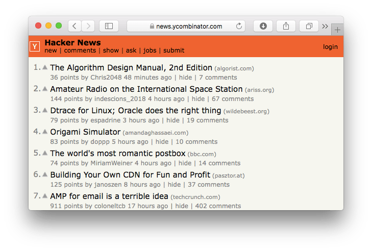

#### The Register: [`theregister.co.uk`](http://www.theregister.co.uk/), ★★★★☆

> Independent news and views for the tech community.

Based in London, UK. Does some really good dry humor, as you would expect.


#### Ars Technica: [`arstechnica.com`](https://arstechnica.com/), ★★★★☆

News, guides, reviews, and features.


#### Hubski: [`hubski.com`](http://hubski.com), ★★★★☆

> A community for sharing thoughtful information and conversation.

Similar to [Lobsters](#lobsters), but focussed on science in general.

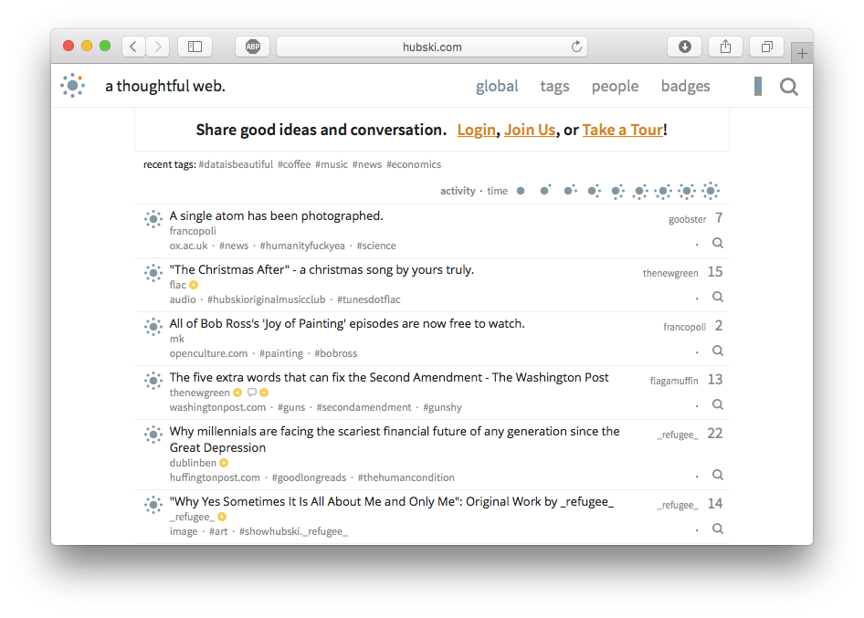

#### The Verge: [`theverge.com`](https://www.theverge.com), ★★★☆☆

<!-- TODO: description -->
Generic tech news.


## Blogs

A few technology/culture centric blogs woth checking out.

#### /dev/lawyer: [`writing.kemitchell.com`](https://writing.kemitchell.com)

> *Law, technology, and the space between*.

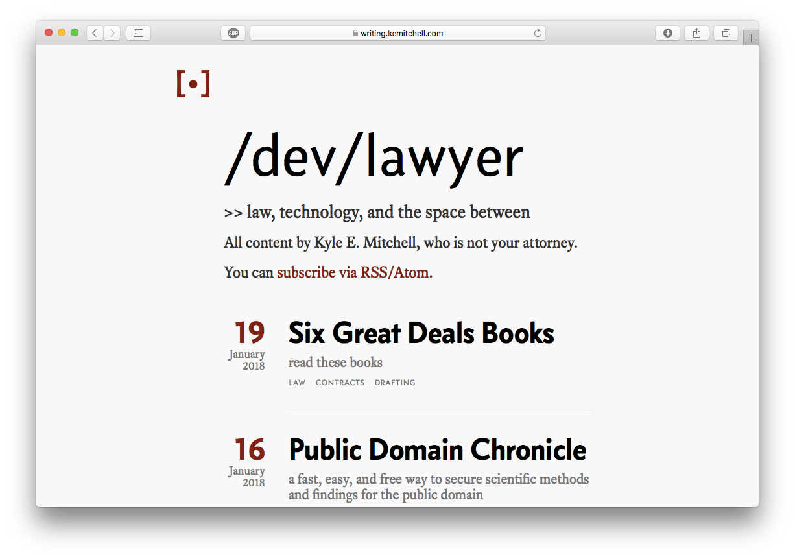

#### Julia Evans: [`jvns.ca`](https://jvns.ca)

> Regular writings involving Rust, Ruby and how to take things like syscalls
> apart.

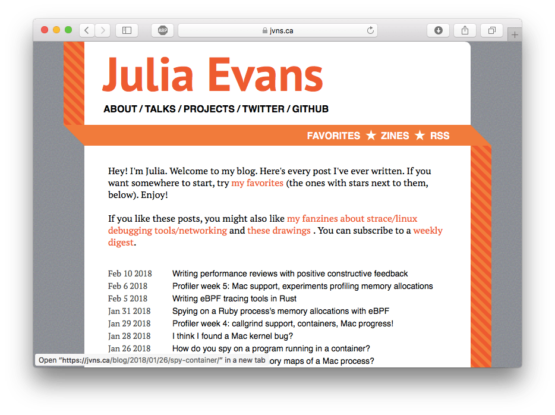

#### Eli Bendersky's Website: [`eli.thegreenplace.net`](https://eli.thegreenplace.net/)

> This blog began in 2003 as a personal online journal; in the past
> few years it became mostly an outlet for technical, programming-related posts.
> It's my way to document things I find interesting for my future self.

Blog about programming in a variety of languages, including Python, C, C++.

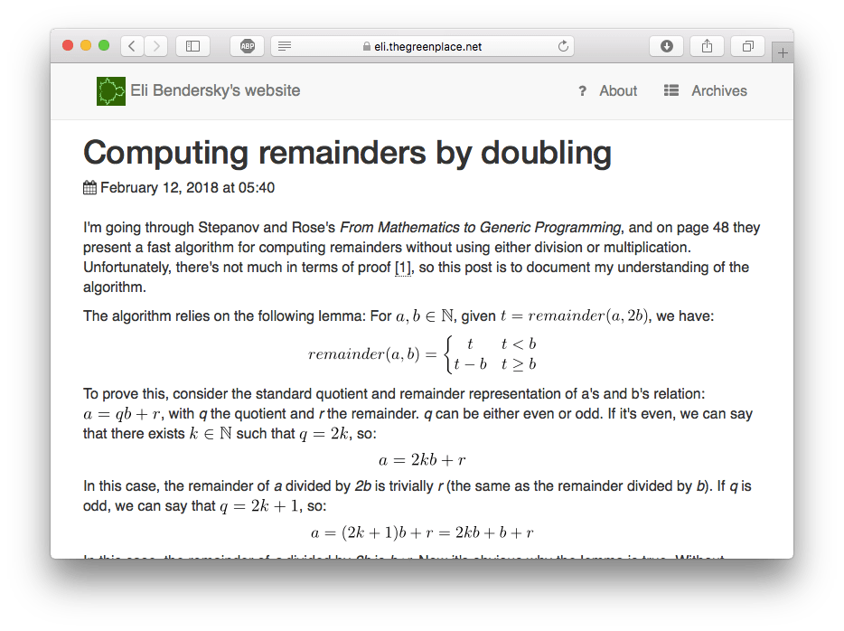

## Videos

#### devttys0: [YouTube Channel](https://www.youtube.com/channel/UCuEqgu-PN4B2Jm_B5tccPCA), ★★★★★

> Adventures in learning and designing analog electronics!


#### Micah Elizabeth Scott: [YouTube Channel](https://www.youtube.com/channel/UCaEgw3321ct_PE4PJvdhXEQ), ★★★★★

> Art, engineering, reverse engineering, and cats!

The awesome fusion of programming and electronics.


#### Xiph Videos [`xiph.org/video`](https://www.xiph.org/video/), ★★★★★

> *[Mini-] series of self-produced videos to spread techie-level knowledge about digital media*.

This two-part series, consisting of *A Digital Media Primer for Geeks* and
*Digital Show & Tell*, you can learn about the interface between analog and digital:
how are analog singals captured? How are they reproduced? What kinds of analog signals
can we capture? What does the sampling frequency have to do with this? What is the
Nyquist frequency? Why does it still make sense to use sampling rates much higher than
the audible spectrum to capture analog signals accurately?

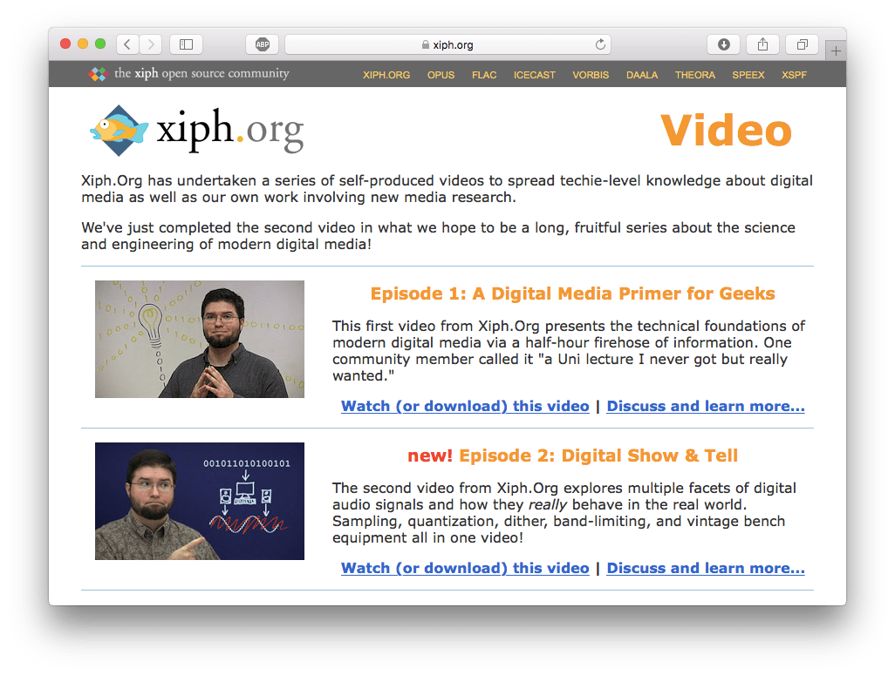

#### CCC Media: [`media.ccc.de`](https://media.ccc.de), ★★★★★

> Offers a wide variety of video and audio material distributed by the Chaos
> Computer Club provided in native formats (usually MPEG and/or Vorbis families)
> for online viewing. Older, archived recordings might require proprietary
> players. The media files on this site can also be downloaded for offline consumption.

Streams recordings (of talks) from events by the CCC, Europe's largest association
of hackers. Has a lot of high-quality content.


# Resources

You want to learn something? You've come to the right place.

## Web

Resources from around the web.

#### Math ∩ Programming: [`jeremykun.com`](https://jeremykun.com)

Has two sections, which are of equally high quality: the 
[Primers](https://jeremykun.com/primers/), which are a terse explanation of
mathematical concepts that are used or useful in computer science.
Is there a topic in mathematics that you don't quite understand or you
want to refresh, but you don't want to read an 800-page mathematics
textbook? Then this section is for you. 

The other section is the [Main Content](https://jeremykun.com/main-content/),
which assumes that you are familiar with all the topics mentioned in the
[Primers](https://jeremykun.com/primers/).


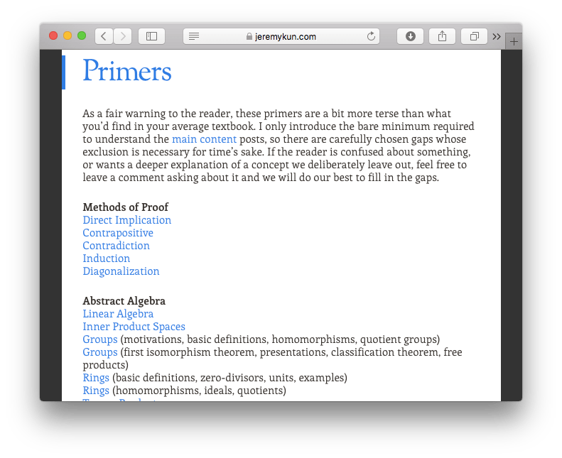

#### [What every computer science major should know](http://matt.might.net/articles/what-cs-majors-should-know/)

Has a very nice overview of the field of computer science, along
with very helpful literature for most parts of it, and what is
expected of a computer scientist to know of each of the parts.

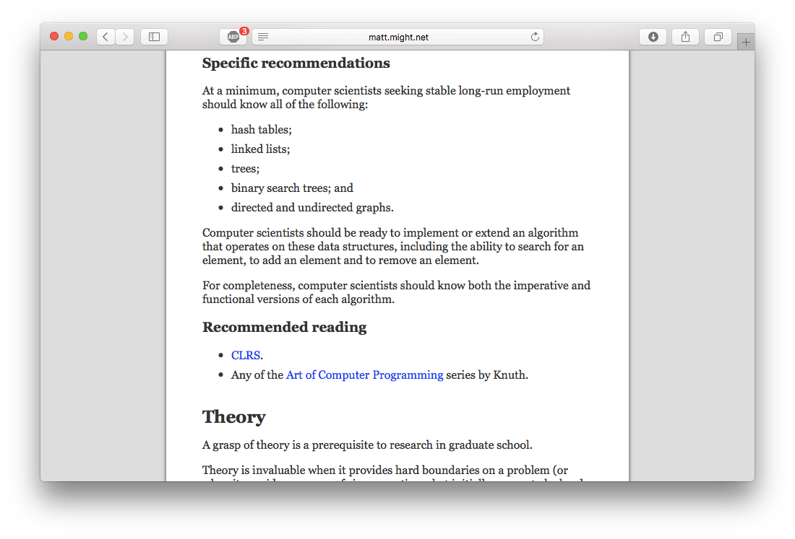

#### [Programming Language Theory](http://steshaw.org/plt/)

> Finding a path to enlightenment in Programming Language Theory can
> be a tough one, particularly for programming practitioners who didn’t
> learn it at school. This resource is here to help. 

Provides a listing of resources to help deepen one's understanding
of PLT. 

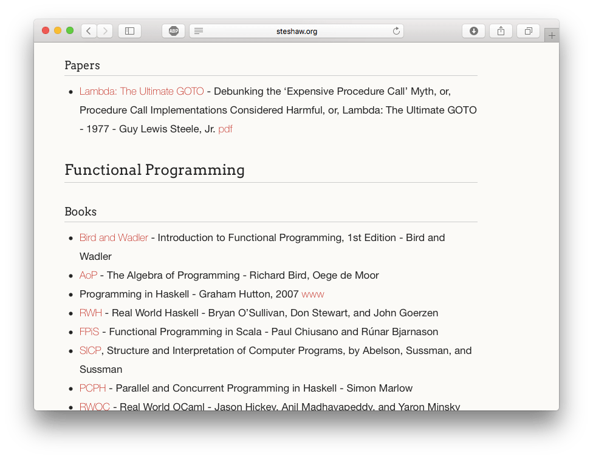

#### [Seeing Theory](http://students.brown.edu/seeing-theory/)

> A visual introduction to probability and statistics.

Want to refresh your knowledge of probability and statistics, but
prefer not to wade through dry textbooks? Then this page is for you.

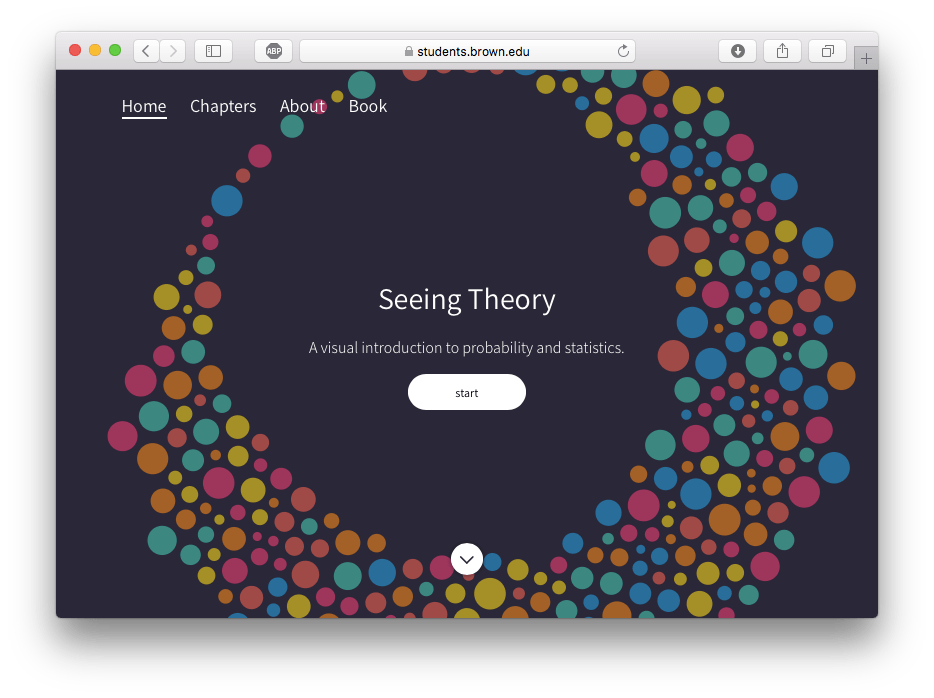

#### Crypto 101: [`crypto101.io`](https://www.crypto101.io)

> An introductory course on cryptography, freely available for programmers of
> all ages and skill levels. Started as a presentation at PyCon 2013. It tries
> to go through all of the major dramatis personae of cryptography to make TLS
> work in 45 minutes. This book is the natural extension of that, with an
> extensive focus on breaking cryptography.

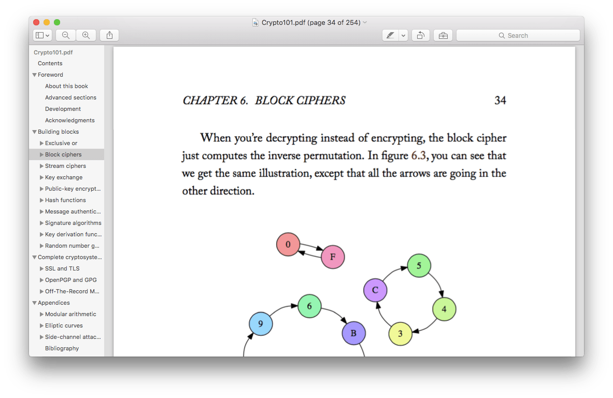

## Books

## Papers

# Challenges

So you think you can code? Well, prove yourself wrong with any one of these
challenges. Choose from math, crypto or coding-themed puzzles.

## Math

#### Project Euler: [`projecteuler.net`](https://projecteuler.net/), ★★★★★

> A series of challenging mathematical/computer programming problems
> that will require more than just mathematical insights to solve.
> Provides a platform for the inquiring mind to delve into unfamiliar
> areas and learn new concepts in a fun and recreational context.

Great place for beginners and more advanced people alike, whether
you are interested in learning or improving your programming skills
or in mathematics.

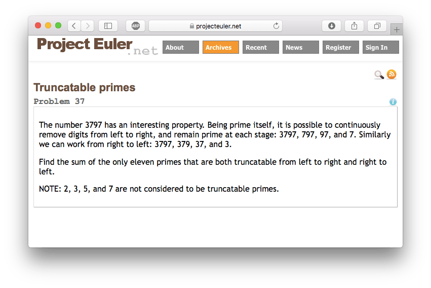

## Crypto

#### matasano: [`cryptopals.com`](http://cryptopals.com), ★★★★★

> A different way to learn about crypto than taking a class
> or reading a book. We give you problems to solve. They're derived
> from weaknesses in real-world systems and modern cryptographic
> constructions. We give you enough info to learn about the underlying
> crypto concepts yourself. When you're finished, you'll not only have
> learned a good deal about how cryptosystems are built, but you'll also
> understand how they're attacked.

Great place for some hands-on experience with cryptography, the
challenges aren't too difficult but they provide a good understanding
of the theory behind some of the crypto we use.

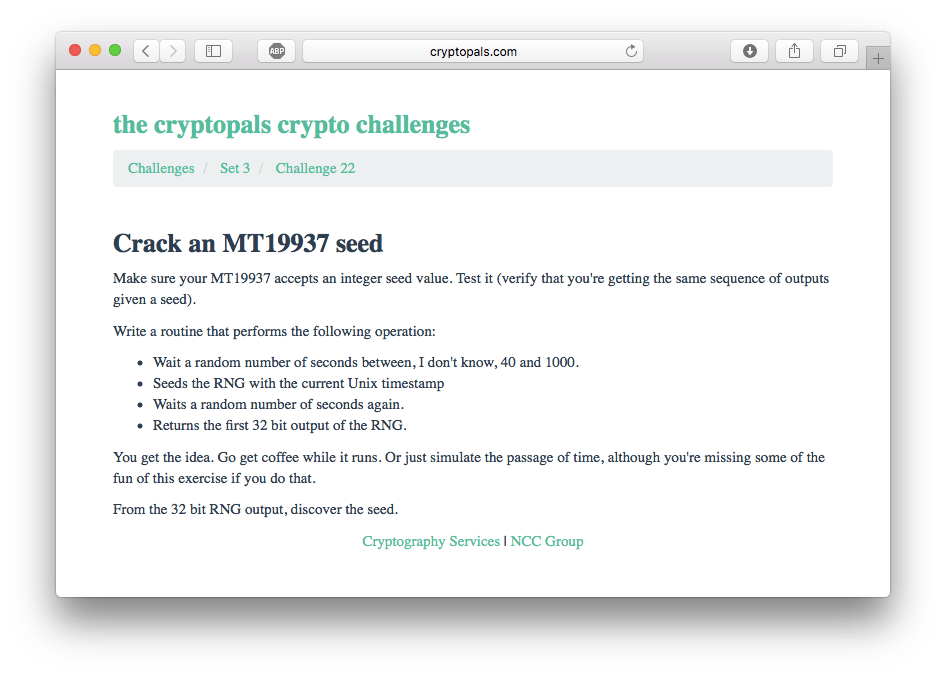

#### id0-rsa: [`id0-rsa.pub`](https://id0-rsa.pub),

> Some problems related to computer security (specifically poorly
> implemented security). You are free to use any language
> and environment you like to complete them. The problems require
> familiarity with programming, but not necessarily with applied
> cryptography or computer security in general.

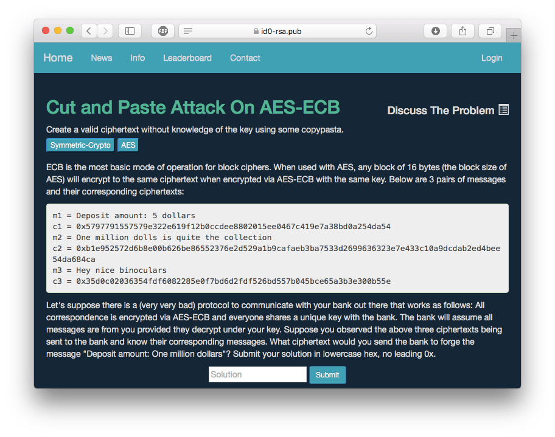

## Coding 

#### CS:APP3e Lab Assignments: [`csapp.cs.cmu.edu/3e/labs.html`](http://csapp.cs.cmu.edu/3e/labs.html)

> This book (CS:APP3e) is the third edition of a book that stems from the
> introductory computer systems course we developed at Carnegie Mellon
> University, starting in the Fall of 1998, called "Introduction to Computer
> Systems" (ICS)

Assignments involving low-level programming, some of them are quite interesting.

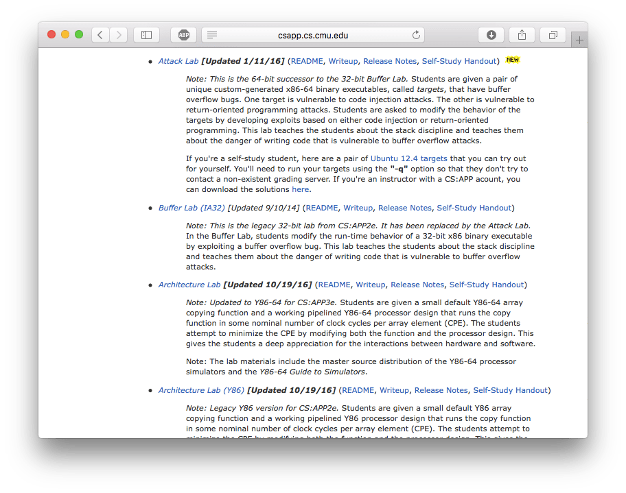

#### CodeChef: [`codechef.com`](https://www.codechef.com)

> CodeChef was created as a platform to help programmers make it big in the
> world of algorithms, computer programming and programming contests. We host
> three featured contests every month and give away prizes and goodies to the
> winners as encouragement. Apart from this, the platform is open to the entire
> programming community to host their own contests. Major institutions and
> organizations across the globe use our platform to host their contests. On an
> average, 30+ external contests are hosted on our platform every month.

## Wargames

These can help you learn security concepts by providing safe and *legal*
environments where you can break security. It's like a sandbox for hackers.

#### Over the Wire: [`overthewire.org/wargames`](https://overthewire.org/wargames/)

> The wargames offered by the OverTheWire community can help you to learn and
> practice security concepts in the form of fun-filled games.

Provides a list of online (hosted) wargames, along with informations on
how to access it (SSH access).

#### We Chall: [`wechall.net`](https://www.wechall.net)

Aggregates resources and links to challenges. Probably more extensive than
my list, and also includes some rather obscure ones. Worth checking out.

## Commercial

There are also some commecial challenges. These websites might offer paid
subscriptions or they might be sponsored by companies and used as recruitment
tools. They still have interesting problems — but some people use these as a
means to get hired instead of out of the pure pleasure of solving a
(complicated) problem.

#### HackerRank: [`hackerrank.com`](https://www.hackerrank.com)

> The HackerRank team is on a mission to match every developer in the world to
> the right job by providing a technical recruiting platform that assesses
> developers based on actual coding skills. Our solution is revolutionizing the
> way companies discover and evaluate talented developers. HackerRank is the
> destination for the best developers to hone their skills and for companies to
> find top software developers.

#### LeetCode: [`leetcode.com`](https://leetcode.com)

> Over 750 questions for you to practice. Come and join one of the largest tech
> communities with hundreds of thousands of active users and participate in our
> contests to challenge yourself and earn rewards.

## Fun

There are also some challenges that are a little more game-like. Some of these
might be good for beginners, while others might be good because you can watch
your code running, live.

#### RubyWarrior: [`bloc.io/ruby-warrior`](https://www.bloc.io/ruby-warrior)

> A TRIUMPHANT QUEST OF ADVENTURE, LOVE & DESTINY 
> ALL WITHIN A FEW LINES OF CODE

You take control over a warrior, by writing a minimalist A.I. to control
him on his quest.


#### Screeps: [`screeps.com`](https://screeps.com)

> Screeps means “scripting creeps.” It’s an open-source sandbox MMO RTS game
> for programmers, wherein the core mechanic is programming your units’ AI. You
> control your colony by writing JavaScript which operate 24/7 in the single
> persistent real-time world filled by other players on par with you.

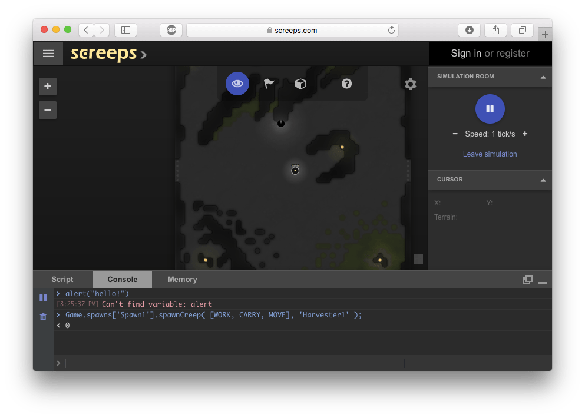

### Resources

You need help with some of these challenges? Or you want to learn
more? These resources might help.

#### Competetive Programmer's Handbook: [`cses.fi/book.html`](https://cses.fi/book.html)

> The purpose of this book is to give the reader a thorough introduction to
> competitive programming. The book is especially intended for students who
> want to learn algorithms and possibly participate in the International
> Olympiad in Informatics (IOI) or in the International Collegiate Programming
> Contest (ICPC).

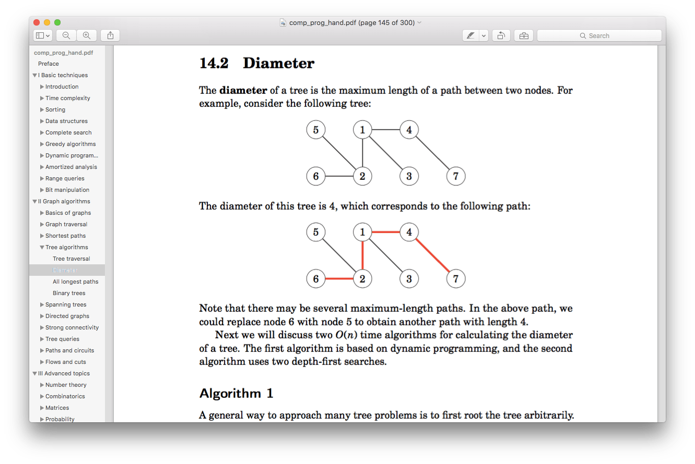

# Design

Programming and Design is inseparably linked — whenever you write code, you design.
That could be the design of the framework, the design of the API, or the
design of the UI. These are some resources that are related to programming and
design.

## Photography

#### Unsplash: [`unsplash.com`](https://unsplash.com), ★★★★★

> Over 300,000 free (do whatever you want) high-resolution photos brought
> to you by the world’s most generous community of photographers.

Need a new wallpaper? A backgroup photo for a website design? Stock photos
to fill in some blanks?


## Fonts

#### nerd-fonts: [`github.com/ryanoasis/nerd-fonts`](https://github.com/ryanoasis/nerd-fonts)

> Project that patches developer targeted fonts with a high number of glyphs
> (icons). Specifically to add a high number of extra glyphs from popular 'iconic
> fonts' such as Font Awesome ➶, Devicons ➶, Octicons ➶, and others.

These are particularily well-suited for use as console fonts, being a
lovechild of traditional monospaced programming fonts and iconic fonts
means you can both use them for programming work as well as to disply
fontawesome icons as outputs in scripts or you can use the powerline
glyphs to aesthetically spice up your `vim`.

#### Input: [`input.fontbureau.com`](http://input.fontbureau.com)

> Flexible system of fonts designed specifically for code by David Jonathan
> Ross. It offers both monospaced and proportional fonts, all with a large
> range of widths, weights, and styles for richer code formatting.

A particularly beautiful set of monospace fonts for programming.

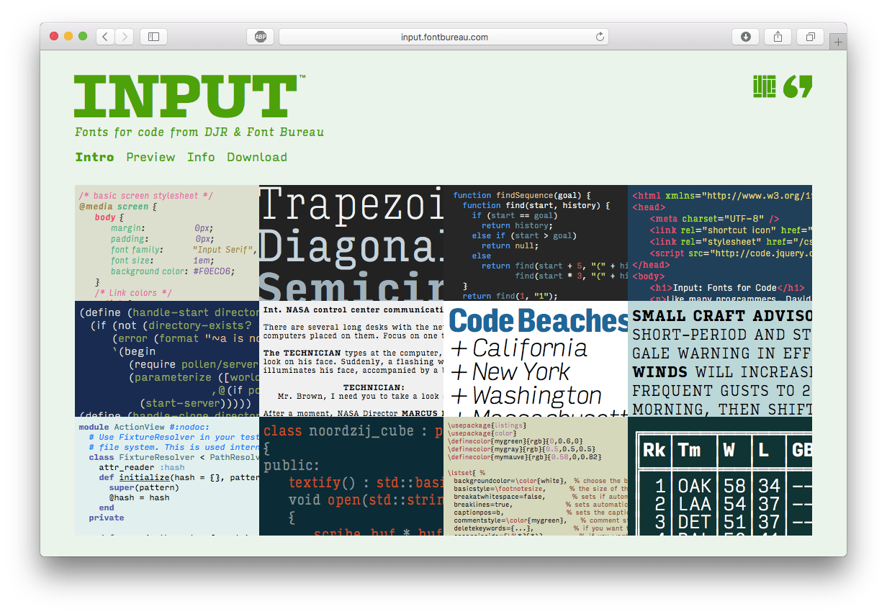

## Other

#### Solarized Colorscheme

*TODO.*

# Tools

In this section I will showcase the most useful tools that I have an use. These
include both command-line and GUI tools. I'm a big proponent for doing things
the command-line way, but there are some things here and there that GUIs are
just better at.

## GUI

#### Dash: [`kapeli.com/dash`](https://kapeli.com/dash)

> An API Documentation Browser and Code Snippet Manager. Dash stores snippets
> of code and instantly searches offline documentation sets for 200+ APIs, 
> 100+ cheat sheets and more. You can even generate your own docsets or request
> docsets to be included.

I literally don't know what I would do without Dash. If you need to find out
the name of a method of a function in a given programming language, if you
need to find out how a given library function works, or for some languages
even if you want to look up the source code of a particular function, Dash
is there for you. No more googling anything, you just download the docsets
for all the languages (and libraries, and Ruby gems, and Npm packages, 
and whatever else you need) and you alwasy have it with you.

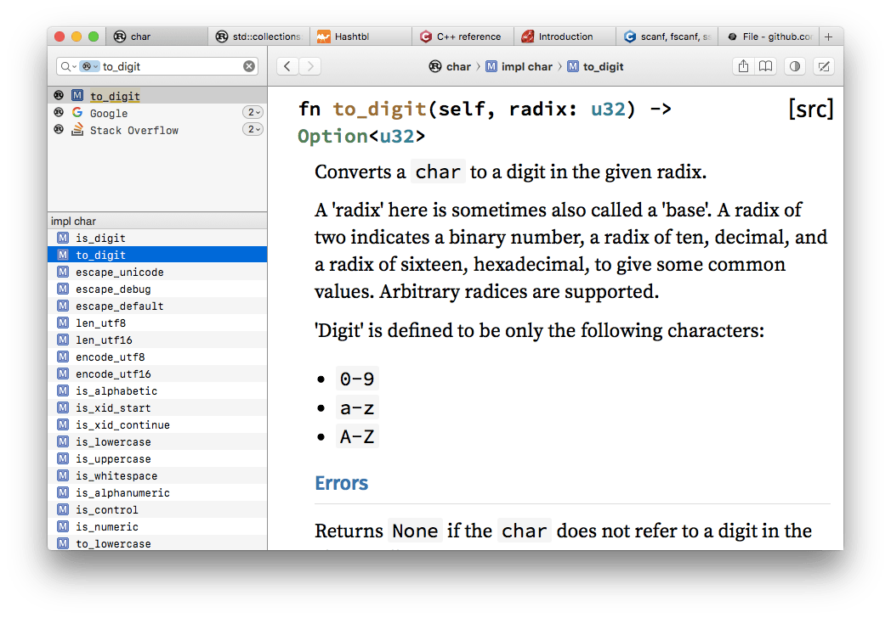

#### Textual: [`codeux.com/textual`](https://www.codeux.com/textual/)

> The world's most popular application for interacting with Internet Relay Chat
> (IRC) chatrooms on macOS.  Includes two elegantly designed dark and light
> variants of the user interface which have been refined all the way down to
> the very last pixel.  Supports very powerful modern technologies such as
> native IPv6, the latest IRCv3 specifications, client-side certificate
> authentication, and much, much more in a easy to navigate, clutter free
> environment.  Protects your privacy by leveraging widely accepted, proven
> technologies such as Off-the-Record Messaging (OTR) to ensure that the only
> people reading your conversations are those that you intend to.

My favourite (and only) GUI IRC client on macOS. It's really beautiful, it just
works, it's not overloaded. Also, it's open source — on the website you won't
find it directly, but the source is on
[GitHub](https://github.com/Codeux-Software/Textual) and it is possible to
build it from source (if you know what you're doing).

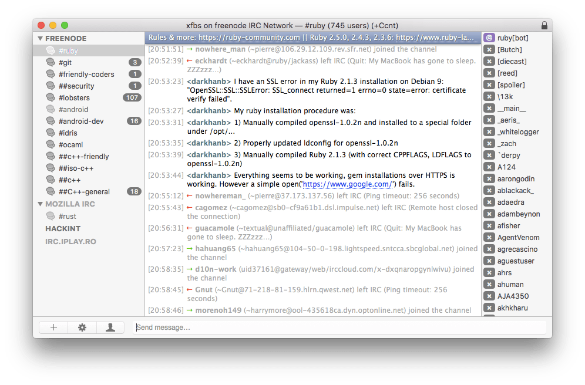

#### GitUp: [`gitup.co`](http://gitup.co)

> Work quickly, safely, and without headaches.  The Git interface you've been
> missing all your life has finally arrived.

Normally, the `git` command-line tool is just what you need. It's more
efficient to use while you're in the terminal anyways, you don't want to
have to mess around with any buttons. But, there is just a handful of 
things that GitUp is really good at:

GitUp can visualize your repo so you know exactly what's going on, and
the great thing is that the visualization is real-time, meaning that it
updates while you mess with your repo.

I think this might just be the best feature of GitUp — it saves snapshots
of your repo before and after you do things, meaning that when you do
something stupid, you can always go back.

Basically any thing you can do with `git`, you can also do with GitUp.

I think as an open-source tool, GitUp is useful to have in your toolbelt.
It might not replace your everyday use of `git`, but it will be there when 
you need it.

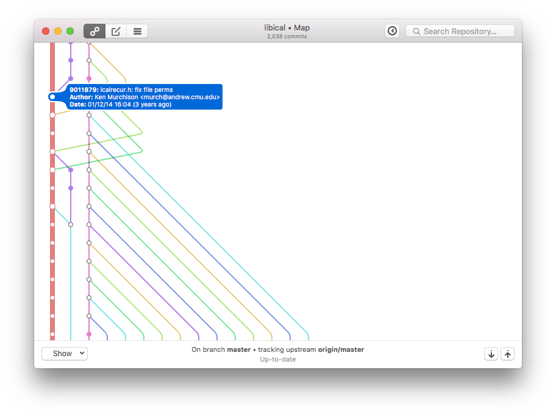

#### Alacritty: [`github.com/jwilm/alacritty`](https://github.com/jwilm/alacritty)

Simple, performant, GPU-accelerated terminal emulator for macOS and Linux.
Probably the fastest terminal emulator out there.

I wrote this whole document in `vim` running inside `tmux` running in `Alacritty`.
Need I say more?

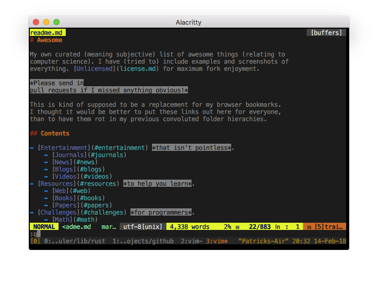

## Basics

#### [tmux](https://github.com/tmux/tmux)

Terminal multiplexer: run multiple virtual terminals in one physical
terminal. Want two terminals side-by-side? No problem. Want four terminals
in one? Easy. Want a large terminal to edit a file and a smaller underneath
to run tests? Done.

#### [Zsh](http://www.zsh.org)

Powerful shell with scripting language.

##### Plugins

- [Oh-My-Zsh](https://ohmyz.sh): Open source, community-driven framework for
  managing your ZSH configuration.
- [Zim](https://github.com/zimfw/zimfw): Zsh configuration framework with
  blazing speed and modular extensions.

#### [Bash](https://www.gnu.org/software/bash/)

The standard shell on most systems. Very simple but decent. This probably comes
pre-installed on your system anyways but hey — sent it some love.

##### Plugins

- [Sensible Bash](https://github.com/mrzool/bash-sensible): Sane bash defaults.

#### [Vim](http://www.vim.org)

> The ubiquitous editor. 

Available on most systems out-of-the-box. Versatile.  Extendable with plugins.
Famously difficult to quit out of.

##### Plugins

- [pathogen.vim](https://github.com/tpope/vim-pathogen)

  Makes it super easy to install plugins and runtime files into their own
  private directories. Why? Because it means that you can clone Vim plugins
  into `~/.vim/bundle` and they will be autoloaded.

- [sensible.vim](https://github.com/tpope/vim-sensible)

  Sensible defaults for Vim.

- [syntastic](https://github.com/vim-syntastic/syntastic)

  Syntax checker for Vim.

- [nerdtree](https://github.com/scrooloose/nerdtree)

  File explorar plugin for Vim.

- [vim-colors-solatized](https://github.com/altercation/vim-colors-solarized)

  Solarized colorscheme for Vim.

- [vim-airline](https://github.com/vim-airline/vim-airline)

  Lean and mean status / tabline for Vim that's light as air.

#### [NeoVim](https://neovim.io)

> Modern editor based on Vim, with better extendability support.

#### [AMP](https://amp.rs)

> No plugins, zero configurations. All the essentials packed in by default.
> Written in Rust, inspired by Vim.

#### Git: [`git-scm.com`](https://git-scm.com)

The one and only; the true path to programmer satisfaction.

# Languages

Which programming languages do I find cool? Which programming languages do I
find useful? Which programming languages would I recommend to a friend to learn?

## Ruby: [`ruby-lang.org`](https://www.ruby-lang.org)

> Ruby is a language of careful balance. Its creator, Yukihiro “Matz”
> Matsumoto, blended parts of his favorite languages (Perl, Smalltalk, Eiffel,
> Ada, and Lisp) to form a new language that balanced functional programming
> with imperative programming.
>
> He has often said that he is “trying to make Ruby natural, not simple,” in a
> way that mirrors life.  Building on this, he adds: Ruby is simple in
> appearance, but is very complex inside, just like our human body.

By far my favourite language. The syntax is very expressive, the standard
library is really good and the package manager,
[RubyGems](https://rubygems.org) is fantastic.

It is very easy to install packages, called *gems* in Ruby teminology:

    $ gem install bcrypt

And in addition to that, Ruby itself is very nice to use. 

```ruby
5.times do
  puts ["Hello", "world!"].join(' ')
end
```

### Tools

#### [Rubocop](https://github.com/bbatsov/rubocop)

> A Ruby static code analyzer, based on the community Ruby style guide.

It is easily installed with RubyGems:

```bash
$ gem install rubocop
```

With a valid ruby file, like such:

###### file: [`examples/rubocop/example.rb`](examples/rubocop/example.rb)

```ruby
# bad -- four spaces instead of two.
def bad_method
    puts "hello!"
end

# bad -- uses semicolon to separate expressions.
bad_method; bad_method

# bad -- no whitespace between operator.
sum = 1+3

# bad -- don't use several empty lines in a row.


puts(sum)
```

Running `rubycop` on it produces a set of warnings (`--format simple` reduces the
verbosity of the output):

```bash
$ rubocop --format simple examples/rubocop/example.rb
== examples/rubocop/example.rb ==
C:  3:  1: Layout/IndentationWidth: Use 2 (not 4) spaces for indentation.
C:  3: 10: Style/StringLiterals: Prefer single-quoted strings when you don't need string interpolation or special symbols.
C:  7: 11: Style/Semicolon: Do not use semicolons to terminate expressions.
C: 10:  8: Layout/SpaceAroundOperators: Surrounding space missing for operator +.
C: 14:  1: Layout/EmptyLines: Extra blank line detected.

1 file inspected, 5 offenses detected
```

Some, but not all issues can be corrected automatically. To tell rubocop to try
to fix things, use the `-a` option, like so:

```bash
$ rubocop --format simple -a examples/rubocop/example.rb
== examples/rubocop/example.rb ==
C:  3:  1: [Corrected] Layout/IndentationWidth: Use 2 (not 4) spaces for indentation.
C:  3: 10: [Corrected] Style/StringLiterals: Prefer single-quoted strings when you don't need string interpolation or special symbols.
C:  7: 11: Style/Semicolon: Do not use semicolons to terminate expressions.
C: 10:  8: [Corrected] Layout/SpaceAroundOperators: Surrounding space missing for operator +.
C: 14:  1: [Corrected] Layout/EmptyLines: Extra blank line detected.

1 file inspected, 5 offenses detected, 4 offenses corrected
```

### Libraries

## Crystal: [`crystal-lang.org`](https://crystal-lang.org/)

> Crystal is a programming language with the following goals:
> - Have a syntax similar to Ruby (but compatibility with it is not a goal)
> - Statically type-checked but without having to specify the type of variables
>   or method arguments.
> - Be able to call C code by writing bindings to it in Crystal.
> - Have compile-time evaluation and generation of code, to avoid boilerplate
>   code.
> - Compile to efficient native code.

Basically, Crystal is like an improved (in terms of performance) version of
Ruby. It is statically typed — but thanks to type inference, you don't have
to specify types. There are some other differences, since it is a compiled
language it's not possible to evaluate code at runtime, but in exchange
the speed is on-par with C.

The [shards](https://crystalshards.xyz) package manager is very useful
because it is decentralized and allows to install dependencies from any
git repository.

```crystal
# A very basic HTTP server
require "http/server"

server = HTTP::Server.new(8080) do |context|
  context.response.content_type = "text/plain"
  context.response.print "Hello world, got #{context.request.path}!"
end

puts "Listening on http://127.0.0.1:8080"
server.listen
```

### Tools

### Libraries

## C

> C (/siː/, as in the letter c) is a general-purpose, imperative computer
> programming language, supporting structured programming, lexical variable
> scope and recursion, while a static type system prevents many unintended
> operations. By design, C provides constructs that map efficiently to typical
> machine instructions, and therefore it has found lasting use in applications
> that had formerly been coded in assembly language, including operating
> systems, as well as various application software for computers ranging from
> supercomputers to embedded systems. *Source:
> [`wikipedia.org`](https://en.wikipedia.org/wiki/C_(programming_language))*

C is a little bit of an oddball: It doesn't really have a website that I
could link to. But I guess that's okay, I mean basically everyone knows it.

What is awesome about it, you ask? The fact that it is still alive. It might
not be the nicest of all languages. In fact, when categorizing it, it is
easiest to list the things that it doesn't have. Without a package manager,
building code is usually done with an embarassingly fragile set of scripts that
are prone to failure when run on an unfamiliar platform. Without namespacing,
most libraries prefix all functions and macros with the name of the library.
Without memory safety, we need all kinds of tools, sanitizers, fuzzers and
checkers to test if programs leak and behave, and even with these tools bugs
and security issues are common. But despite all of that, C is still the most
important language. Not because it is pretty, but because it is one of the most
basic building blocks, with most languages implemented in C. Knowing C is
paramount when trying to understand other languages by digging into their
source code.

### Compilers

#### [Clang](https://clang.llvm.org/)

#### [Clang AddressSanitizer](https://clang.llvm.org/docs/AddressSanitizer.html)

> Fast memory error detector, that can find out-of-bounds accesses, 
> use-after-free, double-free, invalid free, memory leaks.

#### [Clang LeakSanitizer](https://clang.llvm.org/docs/LeakSanitizer.html)

> Run-time memory leak detector.

#### [Clang MemorySanitizer](https://clang.llvm.org/docs/MemorySanitizer.html)

> Detector of uninitialized reads.

#### [Clang UndefinedBehaviourSanitizer](https://clang.llvm.org/docs/UndefinedBehaviorSanitizer.html)

> Fast undefined behavior detector. Modifies the program at compile-time
> to catch various kinds of undefined behavior during program execution, for
> example: using misaligned or null pointers, signed integer overflows, or
> conversion to, from, or between floating-point types which would overflow
> the destination.

#### gcc

### Tools

##### [clang-format](https://clang.llvm.org/docs/ClangFormat.html)

> Tool to format C/C++/Java/JavaScript/Objective-C/Protobuf code.

##### [GDB](https://www.gnu.org/software/gdb/)

> The debugger we all know, love and hate.

##### [LLDB](https://lldb.llvm.org)

> *Next generation, high-performance* debugger.

##### [pfff](https://github.com/facebook/pfff)

> A set of tools and APIs to perform static analysis, code visualizations,
> code navigations, or style-preserving source-to-source transformations such
> as refactorings on source code. There is good support for C, Java,
> Javascript and PHP. There is also preliminary support for other languages
> such as C++, Rust, C#, Html, CSS, Erlang, Lisp, Haskell, Python, OPA and
> SQL. There is also very good support for OCaml code so that the framework
> can be used on the code of pfff itself.

##### [rr](http://rr-project.org)

> Record a failure once, then debug the recording, deterministically, as many
> times as you want.

##### [Valgrind](http://valgrind.org)

> An instrumentation framework for building dynamic analysis tools. Includes
> tools that can automatically detect many memory management and threading
> bugs, and profile code in detail.

### Libraries

#### Snow: [`github.com/mortie/snow`](https://github.com/mortie/snow)

> Header-only unit testing library for C.

C really doesn't have a lot built-in. As far as testing goes, the only
tool that C provides is the `assert()` macro, which can be used to
set run-time assertions, which will abort the program when false.

Snow wraps this into a nice-to-use DSL for defining tests for different
modules and pretty-prints the test invocation.

###### Example

This is what a sample test with snow could look like (adapted from the
[snow GitHub readme](https://github.com/mortie/snow/blob/master/README.md)):

```c
describe(files, {
  it("opens files", {
    FILE *f = fopen("test", "r");
    assertneq(f, NULL);
    defer(fclose(f));
  });

  subdesc(fread, {
    it("reads 10 bytes", {
      FILE *f = fopen("/dev/zero", "r");
      assertneq(f, NULL);
      defer(fclose(f));

      char buf[10];
      asserteq(fread(buf, 1, 10, f), 10);
    });
  });
});

snow_main();
```

#### Jansson: [`github.com/akheron/jansson`](https://github.com/akheron/jansson)

> Parse and generate JSON formatted data.

#### Debug: [`github.com/esneider/debug`](https://github.com/esneider/debug)

> Debug like a sir.

#### utf8.h: [`github.com/sheredom/utf8.h`](https://github.com/sheredom/utf8.h)

> UTF-8 string handling made easy.

#### Onigmo: [`github.com/k-takata/Onigmo`](https://github.com/k-takata/Onigmo)

> Regex library, default library used by Ruby 2.0 and later.

## Rust: [`rust-lang.org`](https://rust-lang.org)

> Rust is a systems programming language that runs blazingly fast, prevents
> segfaults, and guarantees thread safety.
>
> Featuring: zero-cost abstractions, move semantics, guaranteed memory safety,
> threads without data races, trait-based generics, pattern matching, type
> inference, minimal runtime, efficient C bindings, 

We all have a joke or two about a hipster programmer wildly fighting the
Rust borrow checker. It's a beautiful language, with a very intimidating
promise and the potential to rival C. It does have a sweet syntax, taking
in many inspirations from other languages.

### Tools

#### [rustfmt](https://github.com/rust-lang-nursery/rustfmt)

>   A tool for formatting Rust code according to style guidelines.

#### [rustup](https://www.rustup.rs)

> Installer for Rust.

This description is actually a bit underwhelming, since `rustup` does a little
more than just installing Rust. It can keep track of different toolchains for,
you can use it to switch between channels (eg. `stable`, `beta`, `nightly`),
and you can update each toolchain.

### Libraries

## Python: [`python.org`](https://python.org)

## Scheme: [`call-cc.org`](http://call-cc.org)

## OCaml: [ocaml](https://github.com/ocaml/ocaml)

## Node.js: [nodejs](https://github.com/nodejs/node)

## Java9: [java9](https://www.oracle.com/java/java9.html)

## Haskell: [haskell](https://www.haskell.org)

## RISC5: [risc5asm](https://rv8.io)

## C++: [cpp](http://clang.org)

### Tools

#### clang-tidy: [`clang.llvm.org/extra/clang-tidy`](http://clang.llvm.org/extra/clang-tidy/)

>   A clang-based C++ “linter” tool. Its purpose is to provide an extensible
>   framework for diagnosing and fixing typical programming errors, like style
>   violations, interface misuse, or bugs that can be deduced via static
>   analysis.

### Libraries

#### Catch2: [`github.com/catchorg/Catch2`](https://github.com/catchorg/Catch2)

>   Simple unit testing framework for C++

## Swift: [swift](https://github.com/apple/swift)

## Nim: [nim](https://nim-lang.org)

## LuaJIT: [luajit](https://luajit.org/luajit.html)

## D: [`dlang.org`](https://dlang.org/)

# Further

Assorted Awesome lists worth checking out with content related to mine.

- [Awesome C](https://notabug.org/koz.ross/awesome-c)
